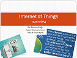

# Internet of Things (IoT)
## Using Arduino for making applications in IoT Ecosystem
> Objective : 

The objective of this material is to gain knowledge on importance of **Internet of Things (IoT)**, the current components of typical IoT devices and trends for the future. The contents focuses on IoT design, design constraints, interfacing between the physical world and devices and further implementation and intergradations of  IoT ecosystems.

> Outcome : 

The reader's will learn to design IoT components which would allow them to innovate new designs and products. They will also learn the most innovative technology after the invention of Internet.  

> Contents/Slides: 

 learn to design IoT components which would allow them to innovate new designs and products. They will also learn the most innovative technology after the [IoT Overview Slide](./Slides/1.IoT_overview.pdf)

 learn to design IoT components which would allow them to innovate new designs and products. They will also learn the most innovative technology after the [Arduino Basics Slide](./Slides/1a.Arduino_Basic.pdf)
