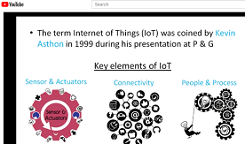

# Internet of Things (IoT)
## Using Arduino for making applications in IoT Ecosystem
> Objective : 

The objective of this material is to gain knowledge on importance of **Internet of Things (IoT)**, the current components of typical IoT devices and trends for the future. The contents focuses on IoT design, design constraints, interfacing between the physical world and devices and further implementation and intergradations of  IoT ecosystems.

> Outcome : 

The reader's will learn to design IoT components which would allow them to innovate new designs and products. They will also learn the most innovative technology after the invention of Internet.  

> Class Example : 

The examples undertaken/coded while demos in class are [available here](./ClassExamples/). 
- 6 weeks summer training programs on IoT [ST390](./ClassExamples/ST390) ,[ST392](./ClassExamples/ST392) ,[ST402](./ClassExamples/ST402) 
- 5 day   [Workshop IoT](./ClassExamples/Workshop_IoT) 
- 6 Months Industrial Training Programmes [PJ120](./ClassExamples/PJ120) 

> Contents/Slides: 

 learn to design IoT components which would allow them to innovate new designs and products. They will also learn the most innovative technology after the [IoT Overview Slide](./Slides/1.IoT_overview.pdf)

  Arduino is Open Source electronic prototyping platform. It is one of most favour platforms with easy to use hardware and software. Arduino family has many ready to use hardware prototyping boards and one the most versatile board is Uno popularly know as Arduino Uno.The slide show explains the basic Input/Output along with other hardware essentials. On the software front, slide discusses the essentials of hello world/blink LED program. [Arduino Basics Slide](./Slides/1a.Arduino_Basic.pdf)

thanks
